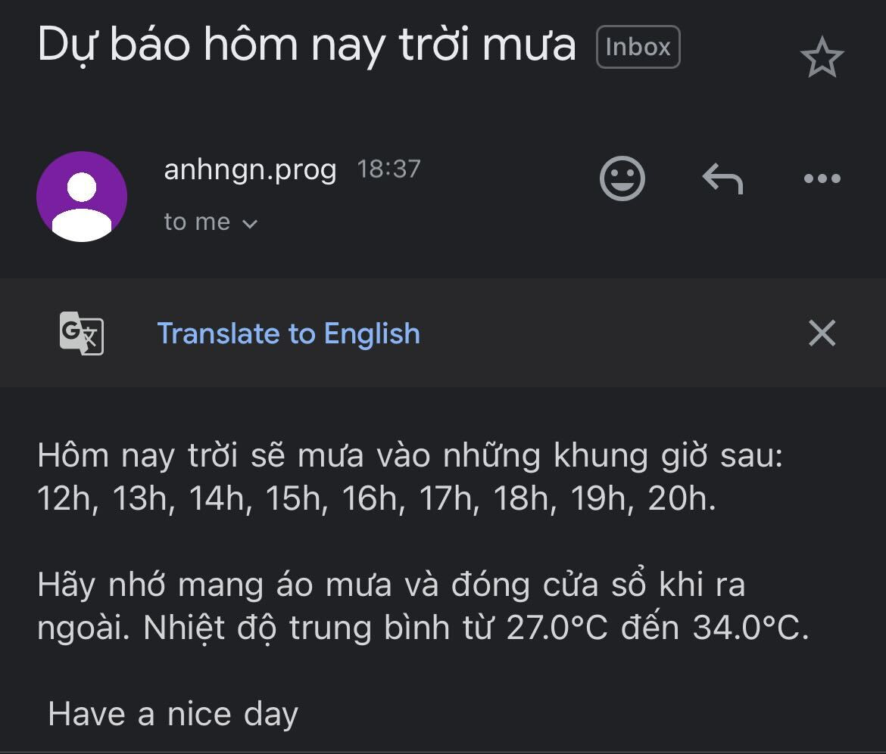

# About
An application which:
1. Call API from [Open-Meteo](https://open-meteo.com/en/docs#latitude=10.823&longitude=106.6296&current=temperature_2m,is_day,precipitation,rain&hourly=temperature_2m,apparent_temperature,precipitation_probability,weather_code,visibility,uv_index&daily=sunrise,sunshine_duration,uv_index_max,rain_sum&timezone=auto&forecast_days=3&models=) to get today temperature and rain probability.
2. If it rains today, email my address to remind me to bring raincoat and close all windows before leaving the house.
3. Set up an auto job in [python-everywhere](https://www.pythonanywhere.com/) to run the code daily at 7:30AM
# Demo email received

